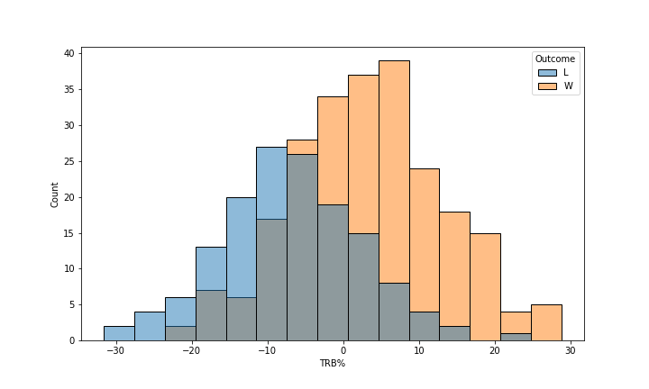

# Predicting NBA win probability using machine learning methods

## Abstract

The aim of this project is to harness historical NBA data in order to gain insights into what statistical factors make a team successful in a given season. The team of focus for this project is the Golden State Warriors, and the box score data for each game within the span of the most recent NBA season is accessed via the Sports Reference API. The concepts and algorithms used range from Bayesian probability to more advanced ML models such as logistic regression and decision trees. With sports fanatics, NBA analysts, and players / coaches in mind, the final deliverable will be a data-driven report with an emphasis on strategic actionability. That is, the results of the model should ideally shed light on how to maximize wins for the GSW in the future.

***Author**: Aarav Noronha*  
***Polygence Mentor**: Sejal Dua*

----------------------------------

## Introduction 

I am interested in this domain because I am an NBA fan (specifically, a Warriors fan) and I wanted to have a better insight into what factors would make it more likely for the Warriors to win a given game.  I figured the best way to do this would be through a Machine Learning model, because it would be able to identify patterns or correlations within the data and make informed predictions. This data could be utilized by sports analysts, coaches, players, etc. who want a better understanding of what statistical elements of a game are impactful, and to what extent, as well as what combinations of stats within a game would give a team the best chance of winning.

## Exploratory Data Analysis

   

  

I found that a team’s offensive rating is very highly correlated to its true shooting percentage as well as its effective field goal percentage, and that those 2 were also highly correlated, which was expected. Additionally, I found that turnover percentage was highly correlated with steals, which was also expected. The total rebound percentage was also highly correlated with both the offensive and defensive rebound percentage, and they were also correlated. The usage percentage data was not as useful because it takes into account many other different variables. Using the heatmap, the highest correlation occurred between the TS% and EFG%, followed by TRB%, ORB% and DRB%, as stated above. The lowest correlation was between STL% and TOV%.

## Features

- `MP`: Minutes Played
- `TS%`: True Shooting Percentage - 2pts, 3pts, FT combined
- `eFG%`: **Effective Field Goal Percentage - Values 3pt shot more than 2**
- `3PAr`: 3-point Attempt Rate - Percentage of FG from 3
- `ORB%`: Offensive Rebound Percentage - estimated % of available off rbd a player grabbed
- `DRB%`: Defensive Rebound Percentage - estimated % of available def rbd a player grabbed
- `TRB%`: **Total Rebound Percentage - estimated % of available rbd a player grabbed**
- `AST%`: Assist Percentage - estimated % of FG a player assisted
- `STL%`: Steal Percentage - estimated % of opp poss ending with steal by player
- `BLK%`: Block Percentage - estimated % of opp 2pt FG blocked by player
- `TOV%`: Turnover Percentage - estimated % of turnovers committed per 100 plays
- `USG%`: Usage Percentage - estimated % of team plays used by player (*NOTE: not useful for team data, only individual players stats*)
- `ORtg`: **Offensive Rating - estimate of pts produced (player) or scored (teams) per 100 poss**
- `DRtg`: Defensive Rating - estimate of pts allowed per 100 poss
- `BPM`: Box Plus/Minus - box score estimate of pts per 100 poss a player contributed above an avg player, translated to an avg team

I hypothesize the bolded features would have the largest impact on game outcomes because:
- Effective Field Goal Percentage accounts for the additional value of a 3 point shot over a 2, so it can more accurately describe how well a team can score
- Total Rebound Percentage takes into account two other features (ORB% and DRB%), which will give more comprehensive data for the rebounding category
- Offensive Rating, similar to eFG, does not measure who scores the most points, but instead measures how efficiently those points are scored. In other words, I hypothesize that PPG for a specific team will not correlate exactly to their ORtg (same logic goes for defensive rating, however, it does not have as large of an impact as its offensive counterpart)

All of the features listed above are being used to train the model, with the exception of minutes played and usage percentage, as they are irrelevant to this model. The target variable is a prediction of a win or loss for GS, taking all of these columns of data into account.

## Models and Results

| Model Name | Training Accuracy | Testing Accuracy |
| ---- | ---- | ---- |
| Logistic Regression | 98.88% | 97.39% |
| Decision Tree | 100% | 98.26% |
| Support Vector Machines | 99.13% | 96.52% |

After analyzing the accuracy of each model based on the training and testing data, I have come to the conclusion that the best model, among the 3 listed above, is logistic regression. The reason I did not choose the decision tree is because of overfitting, which is explained below, but between logistic regression and SVM, the former was slightly preferable to the latter, because although SVM edged out LR by 0.25% on the training data, LR edged out SVM by 0.87% on the testing data. Also, a logistic regression model is generally better suited for structured data and already identified variables than SVM, which can be useful for unstructured or semi-structured data.

Overfitting is clearly occurring with the Decision Tree Model on the training data, as it got 100% accuracy. This means that the model fits exactly against this training data, which is a drawback because it indicates that it is too specific to this data and if given new data, it will be unable to generalize well to it. Upon further research, I have found that decision trees often overfit the data and cannot adjust to new datasets as well as other models. 

